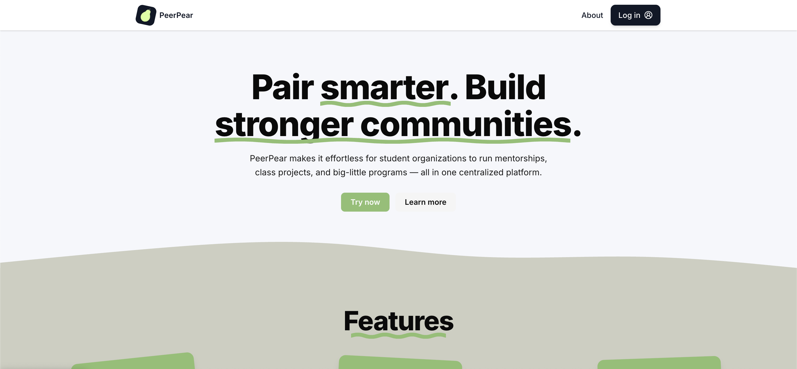
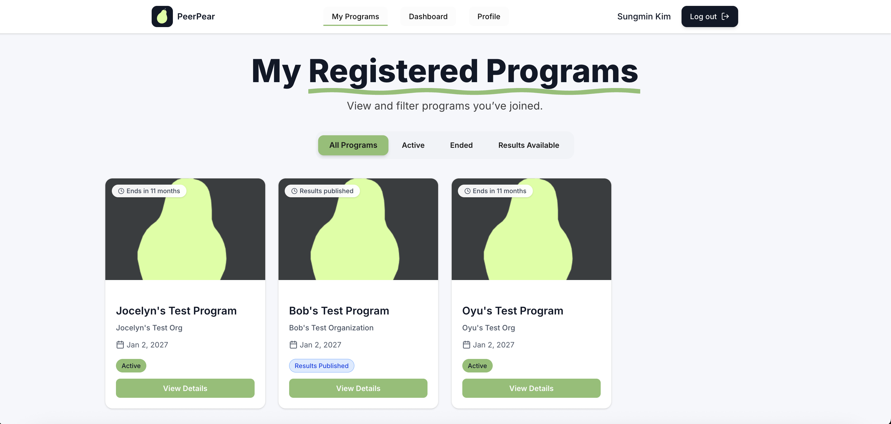

# PeerPear
#### Centralized, LLM-powered Group Pairing Platform for Student Organizations.
Try PeerPear yourself at: https://peerpear.vercel.app/

Home Page

Student User - My Programs

## How to Run the Backend (Locally):
The dependencies in this project are managed through poetry.

0. Populate environment variables:
Create a `.env` file in the `src` folder by referencing `src/.env.example`

1. Install poetry following: https://python-poetry.org/docs/

2. Create venv on your local: `poetry config virtualenvs.in-project true` 

3. Install all dependencies with `poetry install`

4. Optionally, add your own dependencies with `poetry add <dependency group>` to update the .toml and poetry lock files.

5. Run the main backend app locally using `cd src` and `poetry run python wsgi.py`

## How to Run the Frontend (Locally):
0. Populate environment variables:
Create a `.env` file in the `public` folder by referencing `public/.env.example`

1. Navigate to the `public` folder: `cd public`

2. Install all dependencies with `npm install` (or `yarn`, `pnpm`, `bun`)

3. Run the development server with `npm run dev` (or `yarn dev`, `pnpm dev`, `bun dev`)

4. Open [http://localhost:3000](http://localhost:3000) with your browser to see the result.

## Deployment
Our project's backend is currently hosted on [Heroku](https://www.heroku.com/), and frontend on [Vercel](https://vercel.com/). Our DB and image storage bucket uses [Supabase](https://supabase.com/?utm_source=google&utm_medium=cpc&utm_campaign=23317752603&device=c&gad_source=1&gad_campaignid=23317752603&gbraid=0AAAAA_fjjDk1sfXHF39m_F_kZ11vvVlbU&gclid=Cj0KCQiA9OnJBhD-ARIsAPV51xOcyVc7Dnx9JzwTb6tIlYUz6T_kz4ldmll7rAeDndM8iwymAbH0IegaAosjEALw_wcB) services.

## Authentication
You must be authenticated via Princeton University's CAS Authentication System to log in as a student or an organization user. WIP: adding universal authentication methods.

## Google Gemini API
This project uses Google Gemini 2.5 Flash-Lite for the LLM client. To receieve an API KEY to run PeerPear locally, please visit: https://aistudio.google.com/ and set up your project.

## Contributing to the Project
Before contributing to the backend services, please read [this document](/src/README.md) in detail.